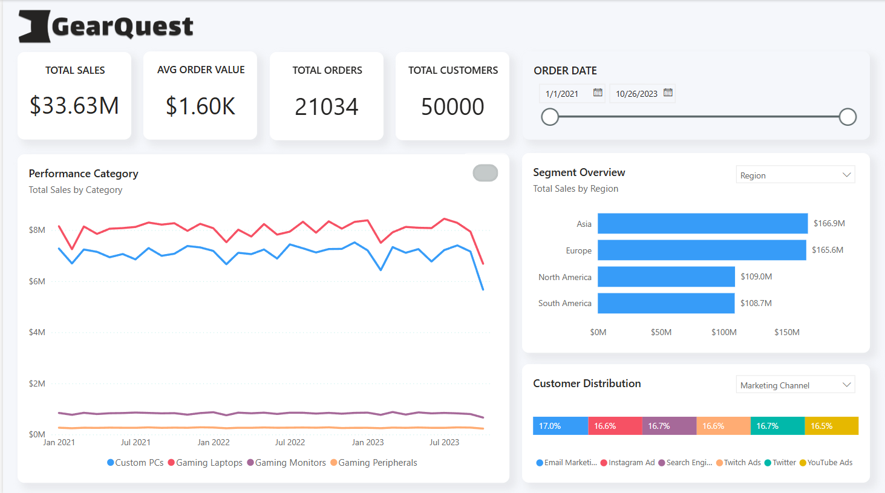

# Sales Pipeline ETL & Tableau/Power BI Dashboard: GearQuest Analysis

This project demonstrates the process of extracting, transforming, and loading (ETL) data from Excel files into both a `.hyper` Tableau extract file and a PostgreSQL database. This facilitates seamless data integration within Tableau and Power BI, enabling enhanced business intelligence visualizations and dashboard creation.

## Tableau Dashboard

The Tableau dashboard is currently being developed using the `.hyper` extract file.

## Power BI Dashboard

📊 **[View Interactive Dashboard](https://app.powerbi.com/view?r=eyJrIjoiNmYyZjMyNWMtYmE1OS00MjRlLWIxMzAtZjJlMmU4ZWQ4NmFhIiwidCI6IjVkNGNmODgzLTJlMzQtNGZlNi04ZDExLWE0ZWE5NTk0ZTQ0YyIsImMiOjF9)** - Explore the live dashboard on Power BI

The Power BI dashboard is connected to a PostgreSQL database populated by this ETL process.



---

## Project Structure

### **Data Pipeline**

1.  **Data Extraction**: Extracts data from multiple Excel files (Orders, Order Status, Products, Geo Lookup, and Customers) using Pandas.
2.  **Data Transformation**:
    -   Integrates data from multiple tables using Pandas' merge function.
    -   Ensures that missing values are compatible with both Tableau and PostgreSQL by converting all `np.nan` entries to `None` (which maps to SQL NULL).
    -   Converts specific numeric columns to the Decimal type, as this precise format is required by Tableau Hyper for inserting rows into the tables accurately.
3.  **Data Loading**:
    -   Loads the transformed data into a Tableau Hyper extract file (`.hyper`) using the `tableauhyperapi` library.
    -   Loads the transformed data into a PostgreSQL database using `psycopg2`.

### **Key Steps**

-   **Data Loading**: Loads data from Excel files into Pandas DataFrames.
-   **Combining Tables**: Merges related tables (Orders + Order Status, Customers + Geo Lookup) to create combined DataFrames.
-   **Data Type Handling**: Inspects and adjusts data types as necessary for compatibility with Tableau Hyper and PostgreSQL formats. Converts relevant columns to Decimal.
-   **Export to .hyper**: Creates a `.hyper` file and inserts the transformed data into the respective tables.
-   **Export to PostgreSQL**: Connects to a PostgreSQL database and upserts the transformed data into the respective tables.

---

## Installation and Setup

1.  **Clone the repository:**

    ```bash
    git clone <repository_url>
    cd <repository_directory>
    ```

2.  **Create a virtual environment (optional but recommended):**

    ```bash
    python3 -m venv venv
    source venv/bin/activate
    ```

3.  **Install dependencies:**

    ```bash
    pip install pandas numpy tableauhyperapi psycopg2 python-dotenv
    ```

4.  **Set up PostgreSQL:**

    -   Ensure you have PostgreSQL installed and running.
    -   Create a database named `gearquest` (or configure the `.env` file accordingly).

5.  **Configure Environment Variables:**

    -   Create a `.env` file in the project root directory.
    -   Add the following environment variables, replacing the values with your PostgreSQL credentials:

        ```
        PG_HOST=<your_postgres_host>
        PG_USER=<your_postgres_user>
        PG_PASSWORD=<your_postgres_password>
        PG_DATABASE=<your_postgres_database>
        ```

    **Note:**  The `.env` file is used to securely store your database credentials.  Make sure to add `.env` to your `.gitignore` file to prevent committing your credentials to a public repository.

6.  **Run the notebook:**

    ```bash
    jupyter notebook etl_to_hyper_postgres.ipynb
    ```

---

## PostgreSQL Export Details

The `etl_to_hyper_postgres.ipynb` notebook includes functionality to export the transformed data to a PostgreSQL database.  The following steps are performed:

1.  **Connect to PostgreSQL:**  The script uses the `psycopg2` library to connect to the PostgreSQL database using the credentials specified in the `.env` file.
2.  **Create Tables:**  If the tables (`orders`, `customers`, `products`) do not exist, they are created with the appropriate schema.
3.  **Upsert Data:**  The script uses an "upsert" operation (INSERT ON CONFLICT DO UPDATE) to efficiently load data into the tables.  This ensures that existing records are updated and new records are inserted.

---

## Data Source

The data used in this project is sourced from the [GearQuest Sales and Customer Insights Dataset on Kaggle](https://www.kaggle.com/datasets/dipunmohapatra/gearquest-sales-and-customer-insights-dataset). The dataset consists of several Excel files: Orders.xlsx, Order\_Status.xlsx, Products.xlsx, Geo\_lookup.xlsx, and Customers.xlsx. These files should be placed in the `data/raw/` directory.

**Note:** These files are assumed to be available and are not included in this repository. Please download them from the Kaggle link provided.

---

## Interactive Dashboards

The goal of this project is to enable the creation of interactive dashboards in both Tableau and Power BI. The Tableau dashboard utilizes the generated `.hyper` file, while the Power BI dashboard connects directly to the PostgreSQL database. These dashboards provide insights into the GearQuest sales pipeline and related data.

## Next Steps
The following steps are planned for future development:

- Create .py script pipelines with PySpark to improve data processing efficiency and scalability.
- Develop an interactive Tableau dashboard using the .hyper extract file for comprehensive data visualization and analysis.